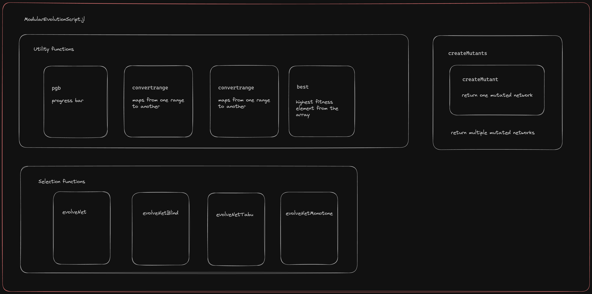

+++
title="Evolutionary algorithms and GRN"
desc="Evolution of Gene Regulatory Networks to desired properties using Evolutionary algorithms"
thumbimage="network-evolution.png"
tags=["Julia", "Graph Theory", "Evolutionary algorithm", "Optimisation"]
+++

## Evolutionary algorithms for GRN

Functions to apply evolutionary algorithms to models of GRN are included here.

<!--  -->
~~~

~~~


### Steps

Include the script in Julia environment 

```julia
include("ModularEvolutionScript.jl")
```

Define a Fitness Function that takes in an interaction matrix, and returns a score.

```julia
fitnessfunction(A) = sum(A) # for example
```

Define an initial network as an interaction matrix.

```julia
J = rand(-1:1, 10, 10) # 10 X 10 random matrix with elements in {-1, 0, 1}
```

Call the evolutionary algorithm function with the above two parameters.

```julia
X, Xs = evolveNet(J, fitnessfunction)
```

`X` is a vector of the best networks at each iteration, and `Xs` a vector of their fitness.


### Available evolution functions

`evolveNet`: Keeps track of all the networks previously generated. New networks generated are tested only if they are not previously generated. (The algorithm slows down with the number of iterations due to this check).

`evolveNetBlind`: Generates mutants at each iteration, selects the best one. No memory of what networks have already been seen. (Likely to get stuck in local optima).

`evolveNetTabu`: Keeps a list of networks seen in the last `k` generations (default `k=10`). Generated mutants are considered only if they are not in this list. 

`evolveNetMonotone`: A mutant is selected only if its score is greater than all the networks previously seen. (And thus may return fewer selected networks than the number of iterations).


### Additional arguments

The functions implementing the evolutionary algorithms can take in these additional parameters.

```JULIA
function evolveNet(J::AbstractMatrix,
                    fitnessFunction::Function;
                    nmutants::Int=10,
                    nr::Int=0,
                    niter::Int=100)
```

`nmutants`: number of mutants generated in each iteration.

`nr`: number of elements mutated at each iteration. (If `0` is passed, the mutation rate is 10%. _i.e,_ 10% of the edges are mutated). 

`niter`: number of iterations of mutation-selection.


